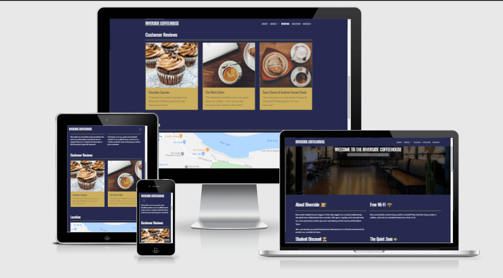

# Riverside Coffeehouse - Milestone Project

Introduction
==

NOTE: **_The Riverside Coffeehouse does not exist._**

Welcome to my first milestone project, Riverside Coffeehouse.

The justification for this project is to show what I have learned so far.

During the Milestone Project I will define the steps, technologies, and resources I have used to build the project. All the while keeping the focus on the User-Centered Design process.

[View the Live Project Here](https://babyoblong.github.io/riverside-fork-repo/)

## User Experience Design

Part of the User-Centric Frontend course touches upon Jesse James Garrett's, "The Elements of User Experience". Originally intended for the web, the strategies outlined in his book "The Elements of User Experience" were adapted in other fields like software development and industrial design.

Our goals as a developer are to get the balance right between User Needs/Goals and Business Needs/Goals. We can do this by following Jesse's five-plane model.

1. Strategy  
2. Scope
3. Structure
4. Skeleton
5. Surface

## Strategy 

### Goals of the site

* Be informative
* Be accessible
* Be clean, simple & effective
* Be an online representation of the Riverside Coffeehouse
* Demographic - teens, students, adults & families

### Demographic

Riverside Coffeehouse has a wide audience and wants to target the site towards adults, teenagers, and families. With this being such a wide audience I thought it best to include certain features that are at the Coffeehouse. 

Teenagers are socially driven, so having a social media presence is considered essential if we are to attract their attention. The ability to check-in to a location will hopefully increase footfall. Advertising Free Wi-fi is also more likely to entice teenagers.

Students are always on the lookout for cheap deals. Incentives such as discounts via the NUS card are always welcomed. Advertising this on the site will likely increase footfall from this demographic.

Adults see a coffee shop as a flexible work location, a relaxed social space, and even quality time with a book. We aim to target this demographic with the advertisement of quieter spaces on-site and study corners.

Families, as the father of two very hungry, almost teenagers we are constantly looking out for Kids Eat Free promotions/offers. Informing potential customers that this is available will likely draw in this demographic.

### User Stories

#### First Time Visitor Goals

- As a first-time visitor I want to be able to understand what the purpose of the site is.
- As a first-time visitor I want to be able to navigate easily without confusion.
- As a first-time visitor I want to be able to view some products.
- As a first-time visitor I want to be able to view location information/opening times.

#### Returning Visitor Goals 

- As a returning visitor I want to be able to contact the owners of the business using both contact forms and external social media.
- As a returning visitor I want to be able to access a downloadable menu.

### Business Goals

- The business wants to be seen as having an online presence.
- The business wants to promote its range of products.
- The business wants to be able to be contacted easily.
- The business wants to be able to receive orders online.
- The business wants social media interaction.

Using the site goals, user stories & business goals defined above I am able to gain a better picture/understanding of what is needed to create a well balanced user-centric site.

### Strategy Trade offs

Taking all of the above into consideration I can move onto creating a feasibility/viability study. What features can we include? What just isn't quite possible yet?

| Opportunity / Problem / Feature        | Importance  | Viability/Feasibility |
| -------------                          |:---:        | -----:    |
| A. Online Ordering                        | 3           |   1       |
| B. Google Maps Location                   | 3           |   5       |
| C. Contact Form                           | 4           |   5       |
| D. Menu/Product Page(images )             | 5           |   5       |
| E. Social Media                           | 4           |   5       |      

### Order of priority/feasibility:-

D - Menu/Product Page is critical for the business and user. It is also viable from a developer perspective.

C, E - Contact Form and Social media are both viable and important from a business perspective/user perspective.

B - Google Maps location whilst it isn't critical, as we could use an address instead of a map, it is however viable so likely to be included.

A - Online Ordering - given the timescale for the project, technical complexity I feel this isn't feasible at this stage. 

## Scope

- What they say they need?
    - The client wants a professional, mobile-friendly, clean site that would start their journey into the online business space. 
    - The client wants to add social media to their site via a link.
    - The client wants a menu/product page - this is vital.
    - The client wants to be able to be contacted by the user using a form.
    - Finally, the client wants to allow online ordering to increase sales. Given the timescale and the complexity of the job which is beyond the scope of the MS1 project, this would have to be added in a later release.

- What they need?
    - Riverside Coffeehouse will benefit from having a mobile-first site.
    - An introduction portion to the Coffeehouse will also be needed to address User Goals.
    - The client wants a menu/product, so they will need downloadable menus.
    - The client will need social media icons to link to their social media site. 
    - The client needs a contact form to better connect with users.

- What they don't know they need?

    - Opening times
    - Food Hygiene Ratings
    - Privacy Policy
    - Cookies Policy

## Structure

From the above information I have decided on the below:-

- Single page site using a family tree structure. (Deviation)
- Header/Navigation
    - Where appropriate(mobile, tablet)a Hamburger icon will be used to allow navigation.
- Seperate pages 
    - For external pages/documents will use target=_blank.
    - Will utilize the header/navigation on the about page across all pages.
- Menus 
    - Dropdown with links to their downloadable menus will be appropriate.
- Footer 
    - Social media icons will open in a new window.

## Skeleton

Below are the links to the intial draft of the wireframes that I had originally created for the project. I deviated from the multi page layout as I felt the flow of information was going to be disjointed.

[Mobile](assets/docs/riversidemobile.pdf)

On mobile, the wireframes almost match the finished product however, there are some differences.

- Logo in Navbar - I left this out as it felt the logo was taking up too much real estate and didn't conform with the goals of the site.

- About Us - In the wireframes that had created I feel I was a little bit optimistic in how much I could fit on the screen comfortably, it was a lot less than I thought. This is the reason the layout has changed.

- End Page - I originally had the idea of having an end page as a sort of thank you for shopping with Riverside however this never made it to fruition as I wanted to keep the site the same throughout. 

[Tablet](assets/docs/riversidetablet.pdf)

- About Us - The carousel idea was scrapped on both tablet and desktop. I felt I would be adding it in for the sake of having a carousel. The jumbotron that replaced it, I feel, is more pleasing to the eye and doesn't confuse users when first landing on the site.

[Desktop](assets/docs/riversidesktop.pdf)

- Navigation - I deviated from the wireframe with regards to the navbar. This was to keep layout changes to a minimum. Moving the position of navigation around too much could confuse users.

Given that this was my first time using Wireframing tools there are a lot of things I would do differently. Creating a wireframe then also creating a mockup would put me in a better position to make judgment calls.

## Surface

- Features
    - Navbar 
        - Responsive across all devices.
        - Each link in the menu has a hover state to indicate to the user what they are about to click/goto.
        - Using Bootstraps scroll spy & offset I was able to highlight each navigation item as they're scrolled into view.
        - Each link when clicked turns white and moves to that section of the page. (This doesn't work for the menu as they are downloadable pdf.)
    - Jumbotron 
        - Used in conjunction with background images to draw attention to the center of the screen.
    - Color Scheme
        - Using coolors.co I created the blue(Space Cadet)/gold colour scheme of the site. It is very pleasing on the eyes.
    - Footer
        - Darkened shade of Space Cadet which helps the items pop out.
        - Social Media icons are placed on the right-hand side.

- Phased Features
    - Given the complexity of Online Ordering that was discussed in the Strategy Trade-Off section, I felt this wouldn't be achievable this time around. I would like to be able to add this sometime in the future.

## Testing

Testing of the site consisted of the below:-

- Chrome Dev Tools
    - Each device resolution was tested individually.
    - This involved clicking all the links within the site to verify each link behaved the correct way.
- Slack
    - Posted my code both in Peer Review channels and some user created sub channels to get feedback.
    - Acted on feedback such as fixing the navbar links that didn't close automatically.
- Lighthouse
    - Performed automatic testing to ensure Performance, Accessibility, Best Practices and SEO were all satisfactory.
- Narrator
    - Using the Narrator to cycle through the elements on the page and make sure the user didn't get stuck.
- Mobile/Tablet
    - Ran the site on real devices I own to get a better idea of how they looked/worked.
    - Dimmed the screen brightness to see the contrast change.
- HTML Validator 
    - Used the direct input to validate HTML code, find errors and fix them.
- CSS Validator 
    - Used the direct input to validate CSS code, find errors and fix them. 

## Technologies Used

### Languages 

- HTML5
- CSS3

### Frameworks, Libraries and Others

- [Cloudflare CDN ](https://www.cloudflare.com/en-gb/cdn/)- This is used to deliver the Bootstrap Framework, jQuery plugins & Popper.js.
- [Bootstrap 4.6.0](https://getbootstrap.com/docs/4.6/getting-started/introduction) - Bootstrap was used for the responsive layout, jumbotron, navbar, form and spacing utilities.
- [jQuery](https://jquery.com/) - The collapsible Hamburger menu in Bootstrap requires this to function.
- [popper.js](https://popper.js.org/) - The collapsible Hamburger menu in Bootstrap requires this to function.
- [CANVA](https://www.canva.com/en_gb/) - Was used to bring a barebones menu to the Food/Drinks menus.
- [Google Fonts](https://fonts.google.com/) - Google Fonts was used to import 'Raleway' and 'Oswald' fonts.
- [Font Awesome](https://fontawesome.com/)- icons were used alongside About, Student Discount, Free-Wifi and Quiet Time headers. It was also used in the social icons in the footer.
- [Git](https://git-scm.com/) - Git was used for the version control software.
- [Github](https://github.com/) - Used to host/clone project files.
- [GitPod](https://gitpod.io/) - GitPod was used to develop the project from the ground, up in the cloud-based environment. 
- [TinyJPG](https://tinyjpg.com/) - resized images to reduce bandwidth and increase site performance.
- [Balsamiq](https://balsamiq.com/) - used to create Wireframes for the project.
- [VSCode](https://code.visualstudio.com/) - Ran out of Gitpod hours and moved to VSCode to keep up with development.
- [Favicon.io](https://favicon.io/) - favicon generator used to create project favicon.
- [MDN](https://developer.mozilla.org/en-US/) - Mozilla Developer Network was used to clarify certain subjects.
- [Ebook](http://www.jjg.net/elements/pdf/elements_ch02.pdf) - helped with the explanation of UX Design and UX Planes.
- [Coolors.co](https://coolors.co/) - this site helped with the color scheme which is a blue(Space Cadet) and gold.
- [Unsplash](https://unsplash.com/) - photos used across the site are all from Unsplash.
- [Grammarly](https://www.grammarly.com/) - to try and counteract my poor spelling & grammar.

## Deployment 

The project has been deployed on Github pages using the process below.

### Deploying to Github Pages

- From the main overview select the repository you wish to deploy.
- Navigate and click on the settings icon on the menu.
- On the left vertical navigation click pages.
- Under source, set the branch to Master and click save.
- Once it has finished you should see the following message "Your site is ready to be published at (insert url here)". 

### Forking the Repository

Forking a repository allows you to copy the repository so that you can make changes without affecting the main repository.

- Select the GitHub repository.
- In the top right, underneath your profile icon select fork.
- You have successfully forked a repository.

### Cloning 

- Select the GitHub repository
- Click the code button(has a download icon)
- Copy the link given
- In Gitpod Terminal, select the directory you wish to populate with the clone.
- Type git clone and paste the link shown earlier and hit enter.
- This can also be done in VSCode.

### Known Issues

There are currently no known issues that I am aware of.

## Credits

- Stackoverflow 
    - Providing the code needed to stop the obscuring of headers when using a fixed navbar.

- Harry Dhillon
    - For taking the time out to go through my code.

- mini_feb_team
    - For taking the time out to go through my code and also ensuring I didn't have a breakdown.

- Maranatha Ilesanmi 
    - Guiding me through the project.

- My Wife 
    - For listening to the ramblings of a madman.

- My Kids
    - Accepting the fact that Daddy had work to do, and trying to keep the noise to a minimum.

